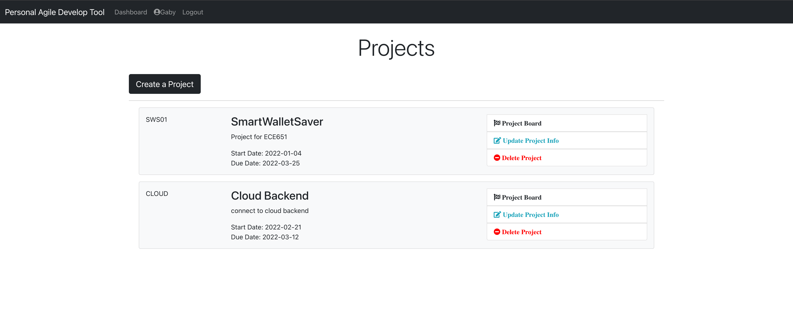
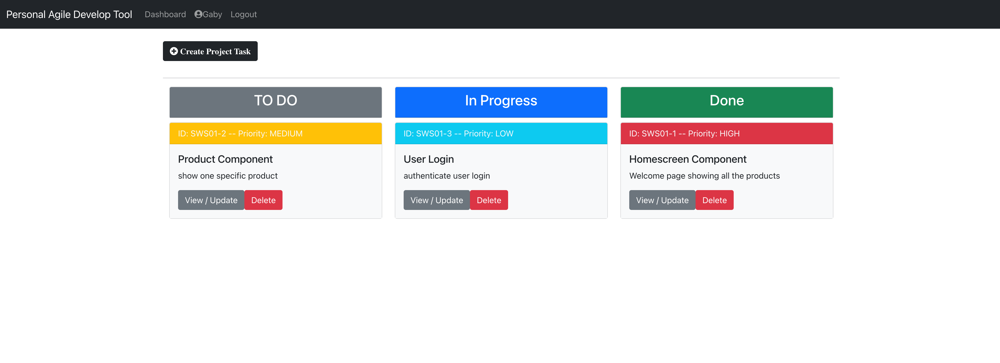

# Personal-Agile-DevTool
Live at https://personal-agile-devtool.herokuapp.com
## What is Personal Agile Develop Tool?
Personal Agile Develop Tool is a personal project management tool that allows you to track the project development process and manage project development tasks. 
This tool follows the principles of agile development, allowing you to manage personal development projects more efficiently.

## ScreenShots




## Prerequisites
- JDK 8
- Spring Boot
- Maven
- Node
- NPM
- MySQL

## Installation
### Database
1. create local database
2. setup database config in AgileDevTool/backend/src/main/resources/application.properties

### Backend
1. run AgileDevTool/backend/src/main/java/com/example/ppmtool/PpmtoolApplication.java

### Frondend
1. modify AgileDevTool/frontend/package.json
  - set "proxy": "https://localhost:8080"
2. run locally
```
cd frontend
npm install
npm start
```
